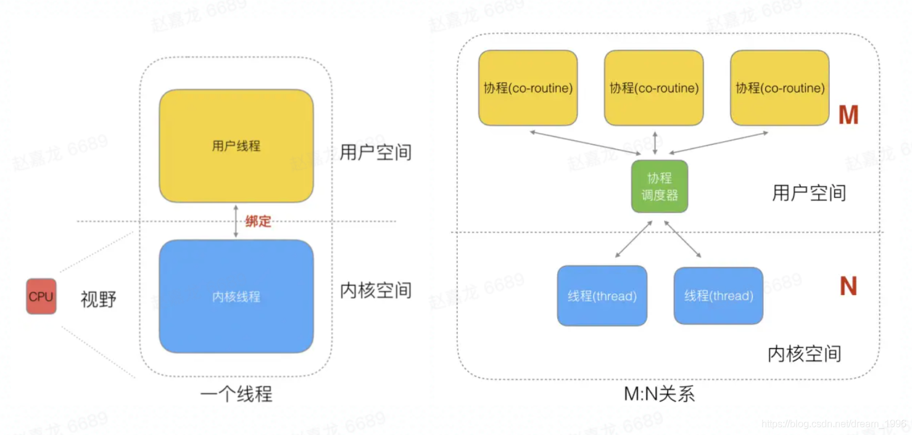
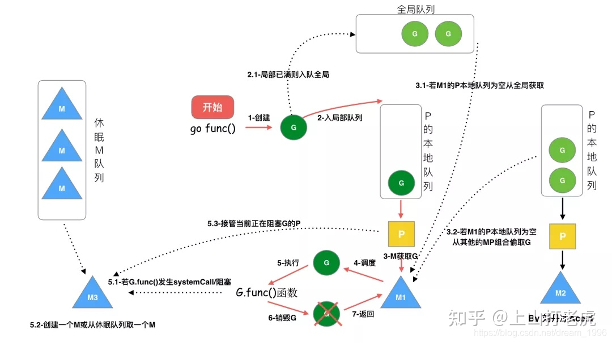

### 基础语法
#### 1、golang 中 make 和 new 的区别？（基本必问）
* make和new都是golang用来分配内存的內建函数，且在堆上分配内存，make 即分配内存，也初始化内存。new只是将内存清零，并没有初始化内存。
* make返回的还是引用类型本身；而new返回的是指向类型的指针
* make只能用来分配及初始化类型为slice，map，channel的数据；new可以分配任意类型的数据
* make 和 new 虽然都用来初始化新变量，但适用的情况却不一样，make 主要用来初始化三种内置的引用类型的数据结构，而 new 则更通用一些，主要为一些值类型的变量申请内存

#### 2、数组和切片的区别 （基本必问）
#### 3、for range 的时候它的地址会发生变化么？
#### 4、go defer，多个 defer 的顺序，defer 在什么时机会修改返回值？
#### 5、 uint 类型溢出
#### 6、介绍 rune 类型
```
// rune is an alias for int32 and is equivalent to int32 in all ways. It is
// used, by convention, to distinguish character values from integer values.

//int32的别名，几乎在所有方面等同于int32
//它用来区分字符值和整数值
len(str)=len([]byte(str))=len([]int8(str))

len([]rune(str))
```
- byte 等同于int8，常用来处理ascii字符
- rune 等同于int32,常用来处理unicode或utf-8字符
#### 7、 golang 中解析 tag 是怎么实现的？反射原理是什么？
tag是通过反射实现的，可以通过tag的使用可以减少代码量，尤其是在使用框架时

##### 反射的原理
动态的获取对象的信息及动态的调用，称为反射

#### 8、调用函数传入结构体时，应该传值还是指针？ （Golang 都是传值）
#### panic、recover
```
Panic是内建的停止控制流的函数。相当于其他编程语言的抛异常操作。当函数F调用了panic，F的执行会被停止，在F中panic前面定义的defer操作都会被执行，然后F函数返回。对于调用者来说，调用F的行为就像调用panic（如果F函数内部没有把panic recover掉）。如果都没有捕获该panic，相当于一层层panic，程序将会crash。panic可以直接调用，也可以是程序运行时错误导致，例如数组越界。
Recover是一个从panic恢复的内建函数。Recover只有在defer的函数里面才能发挥真正的作用。如果是正常的情况（没有发生panic），调用recover将会返回nil并且没有任何影响。如果当前的goroutine panic了，recover的调用将会捕获到panic的值，并且恢复正常执行。
defer
Defer语句将一个函数放入一个列表（用栈表示其实更准确）中，该列表的函数在环绕defer的函数返回时会被执行。
defer通常用于简化函数的各种各样清理动作，例如关闭文件，解锁等等的释放资源的动作
defer函数调用的顺序是后进先出。
```

#### context相关
+ 1、context 结构是什么样的？
+ 2、context 使用场景和用途
#### channel相关
+ 1、channel 是否线程安全？锁用在什么地方？
+ 2、go channel 的底层实现原理 （数据结构）
+ 3、nil、关闭的 channel、有数据的 channel，再进行读、写、关闭会怎么样？（各类变种题型）
+ 4、向 channel 发送数据和从 channel 读数据的流程是什么样的？
+ channel源码分析
https://zhuanlan.zhihu.com/p/299592156
#### map相关
+ 1、map 使用注意的点，并发安全？
+ 2、map 循环是有序的还是无序的？
+ 3、 map 中删除一个 key，它的内存会释放么？
+ 4、怎么处理对 map 进行并发访问？有没有其他方案？ 区别是什么？
+ 5、 nil map 和空 map 有何不同？
+ 6、map 的数据结构是什么？是怎么实现扩容？
#### GMP相关
+  1、什么是 GMP？（必问）
+  2、进程、线程、协程有什么区别？
+  3、抢占式调度是如何抢占的？
+  4、M 和 P 的数量问题？
####  锁相关
+  1、除了 mutex 以外还有那些方式安全读写共享变量？
+  2、Go 如何实现原子操作？
+  3、Mutex 是悲观锁还是乐观锁？悲观锁、乐观锁是什么？
+  4、Mutex 有几种模式？
+  5、goroutine 的自旋占用资源如何解决 
#### 并发相关
+ 1、怎么控制并发数？
+ 2、多个 goroutine 对同一个 map 写会 panic，异常是否可以用 defer 捕获？
+ 3、如何优雅的实现一个 goroutine 池（百度、手写代码）
#### GC相关
+ 1、go gc 是怎么实现的？（必问）
+ 2、go 是 gc 算法是怎么实现的？ （得物，出现频率低）
+ 3、GC 中 stw 时机，各个阶段是如何解决的？ （百度）
+ 4、GC 的触发时机？
#### 内存相关 
+ 1、谈谈内存泄露，什么情况下内存会泄露？怎么定位排查内存泄漏问题？
+ 2、知道 golang 的内存逃逸吗？什么情况下会发生内存逃逸？
+ 3、请简述 Go 是如何分配内存的？Channel 分配在栈上还是堆上？哪些对象分配在堆上，哪些对象分配在栈上？
+ 4、介绍一下大对象小对象，为什么小对象多了会造成 gc 压力？


## GO学习资料
https://blog.csdn.net/heiyeshuwu/article/details/123129290?spm=1001.2014.3001.5501

### Go语言入门系列
《跟煎鱼学 Go》 (eddycjy.com)

### Go语言圣经（中文版）

前言 · Go语言圣经 (studygolang.com)

### 【Go语言中高级学习材料】
Go 语言高性能编程

Go 语言高性能编程 | 极客兔兔 (geektutu.com)

Go 语言设计与实现 #

Go 语言设计与实现 | Go 语言设计与实现 (draveness.me)

### 【Go 语言笔试面试题汇总】
Go 语言笔试面试题汇总 | 极客面试 | 极客兔兔 (geektutu.com)

golang 语言面试题总结 - 《GO 面试题》 - 技术池(jishuchi.com)

golang 语言面试题解析 - 《GO 面试题》 - 技术池(jishuchi.com)

你遇到过哪些高质量的 Go 语言面试题？ - 知乎 (zhihu.com)

字节跳动的 Go 语言面试会问哪些问题? - 云+社区 - 腾讯云 (tencent.com)

golang面试题整理 - Go语言中文网 - Golang中文社区 (studygolang.com)

Go：100道Go语言面试题_鄢秋实的博客-CSDN博客_go语言面试

[吐血整理]超全golang面试题合集+golang学习指南+golang知识图谱+成长路线 | Go 技术论坛 (learnku.com)

Go 语言面试题 100 讲 (iswbm.com)

Go语言面试宝典 — Go语言面试宝典 1.0.0 documentation (iswbm.com)

### 除Go以外其他技术方向参考：

studygolang/Go-Interview-QA: Go语言面试问答 ([github.com](https://github.com/studygolang/Go-Interview-QA))

（含有知识点：网络、数据结构与算法、Go、Web、MySQL、Redis、Linux、安全、设计模式、架构 等


channel
sync.map
垃圾回收
gpm
###  gorutine
  参考博客
https://blog.csdn.net/dream_1996/article/details/118051217

多进程、多线程已经提高了系统的并发能力，在高并发场景下，如果一个线程阻塞cpu，那就需要切换其他线程中去执行，为每个任务都创建一个线程成本比较高，因此又衍生出协程。我们知道一个线程分为“内核态“线程和”用户态“线程，goroutine是Go语言实现的用户态线程， 协程跟线程是有区别的，**线程由CPU调度是抢占式的，协程由用户态调度是协作式的**，一个协程让出CPU后，才执行下一个协程。


##### 思考为什么协程和线程是M:N映射关系？
M个协程可以在用户态线程即完成切换，不会陷入到内核态，这种切换非常的轻量快速，但是一旦某协程阻塞，造成线程阻塞，本进程的其他协程都无法执行了，无并发能力，因此需要N个线程

线程成本高主要表现在以下两个方面：

###### 调度的高消耗CPU；
操作系统线程的创建和切换都需要进入内核，都会占用很长时间，导致CPU有很大的一部分时间都被用来进行进程调度了
###### 高内存占用；
内核在创建操作系统线程时默认会为其分配一个较大的栈内存(进程虚拟内存会占用4GB[32位操作系统], 而线程也要大约4MB)

##### 而相对的，用户态的goroutine则轻量得多：

goroutine是用户态线程，创建和切换都在用户代码中完成而无需进入操作系统内核
goroutine启动时默认栈大小只有2k，可自动调整容量

###### GM模型


在12年的go1.1版本之前用的都是GM模型, G为Goroutine协程，M为Machine内核级线程, M想要执行、放回G都必须访问全局G队列，并且M有多个，即多线程访问同一资源需要加锁进行保证互斥/同步，所以全局G队列是有互斥锁进行保护的。

- 1.创建、销毁、调度G都需要每个M获取锁，这就形成了激烈的锁竞争
- 2.很差的局部性。比如当G中包含创建新协程的时候，M0创建了G1，因为将

**GPM的几个字母概念**
- G1放入全局队列，，需要把G1交给M’执行，也造成了很差的局部性，因为G’和G是相关的，最好放在M上执行，而不是其他M

- g的结构体： 它保存了goroutine的所有信息, 如保存调度信息
m结构体： Machine内核级线程, 每个工作线程都有唯一一个m结构体的实例对象与之对应，线程通过 ThreadLocal 存储各自的m对象；m结构体对象主要记录着工作线程的诸如栈的起止位置、当前正在执行的goroutine以及是否空闲等等状态信息之外，还通过指针维持着与p结构体的实例对象之间的绑定关系。

- p结构体： P全称为Processor,所有的P都在程序启动时创建，每一个m都会与一个p结构体的实例对象关联在一起, p主要维护一份局部goroutine运行队列

**调度策略**


- 我们通过 go func()来创建一个goroutine
- 有两个存储G的队列，一个是局部调度器P的本地队列、一个是全局G队列。新创建的G会先保存在P的本地队列中，如果P的本地队列已经满了就会保存在全局的队列中
- G只能运行在M中，一个M必须持有一个P，M与P是1：1的关系。M会从P的本地队列弹出一个可执行状态的G来执行，如果P的本地队列为空，就会向其他的MP组合偷取一个可执行的G来执行
- 一个M调度G执行的过程是一个循环机制，如下伪代码所示
- 当M执行某一个G时候如果发生了syscall或则其余阻塞操作，M会阻塞，如果当前有一些G在执行，runtime会把这个线程M从P中摘除(detach)，然后再创建一个新的操作系统的线程(如果有空闲的线程可用就复用空闲线程)来服务于这个P
- 当M系统调用结束时候，这个G会尝试获取一个空闲的P执行，并放入到这个P的本地队列。如果获取不到P，那么这个线程M变成休眠状态， 加入到空闲线程中，然后这个G会被放入全局队列中

## pprof
https://sszt-gateway.speiyou.com/beibo/transcode/debug/pprof/goroutine?debug=1

### gin 生成swagger文档
 swag init -g ./coursewaredata.go --parseVendor

