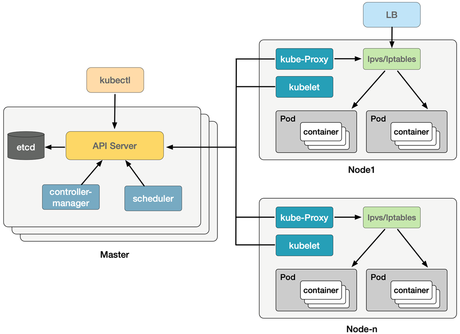
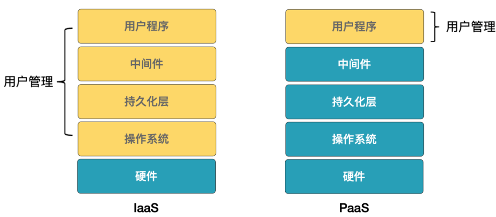

### 指令
- kubecm switch 切换 
- kubectl get node -n  namespace 查看命名空间下的node节点
- kubectl node-shell nodename 登入node的节点操作node

### k8s的发展
bolg:https://blog.csdn.net/QcloudCommunity/article/details/125650918

- 裸金属架构->宿主机架构
- VMM直接安装和运行在物理机上->物理机上首先会装一个操作系统，VMM安装和运行在操作系统上；
### 容器编排的重要性
### 容器编排
- 当Docker解决了应用打包的问题后，PaaS上应用大规模部署与管理的问题愈发突出。此时，业内明白：容器本身没有“价值”，有价值的是容器编排。

- 容器编排(Orchestration)：对Docker及容器进行更高级更灵活的管理，按照用户的意愿和整个系统的规则，完全自动化的处理好容器之间的各种关系（对象之间的关系远重要于对象本身）。

- 容器技术做为底层基础技术，只能用来创建和启动容器的小工具，最终只能充当平台项目的“幕后英雄”。用户最终部署的还是他们的网站、服务、数据库，甚至是云计算业务。这就需要一个真正的PaaS平台，让用户把自己的容器应用部署在此之上。
### k8s 整体架构
#### master 核心组件
- API Server。集群控制的唯一入口，它是各个组件通信的中心枢纽。

- controller-mananger。负责编排，用于调节系统状态。内置了多种控制器（DeploymentController、- ServiceController、NodeController、HPAController等）是Kubernetes维护业务和集群状态的最核心组件。

- scheduler。集群的调度器，它负责在Kubernetes集群中为Pod资源对象找到合适节点并使其在该节点上运行。

- etcd。用于存储Kubernetes集群的数据与状态信息。
#### work工作组件
- kubelet：负责Pod对应容器的创建、启停等任务，是部署在Node上的一个agent。

- kube-proxy：实现Service通信与负载均衡机制。

- 容器运行时(如Docker)：负责本机的容器创建和管理。
- API Server中心枢纽
### k8s架构图

### iaas pass 区别
